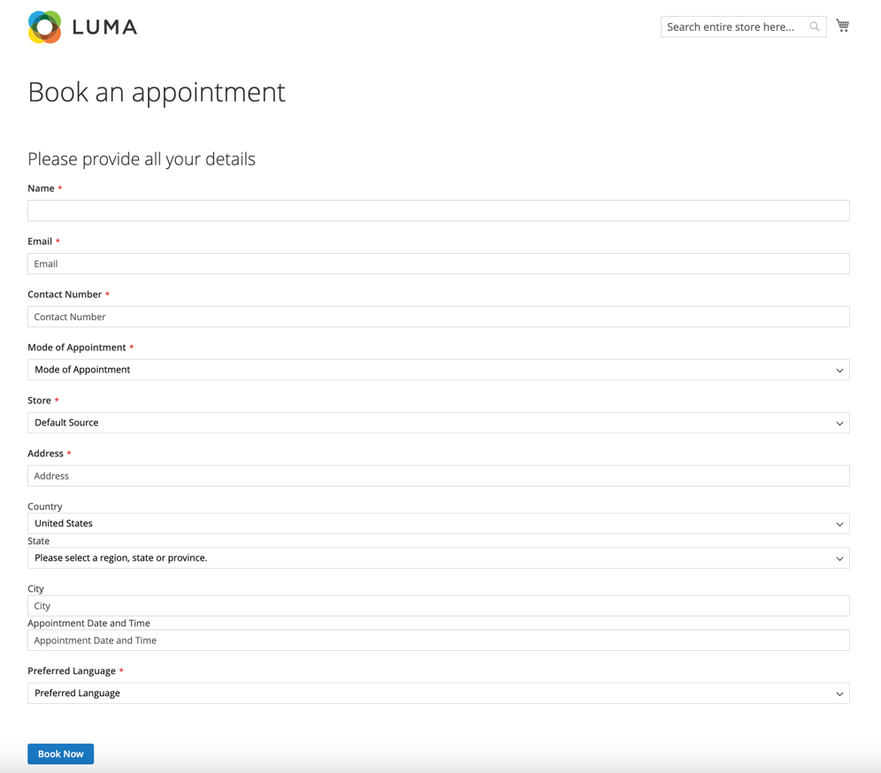
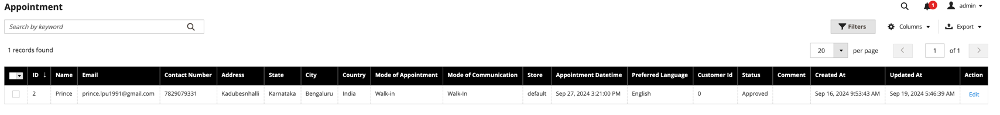
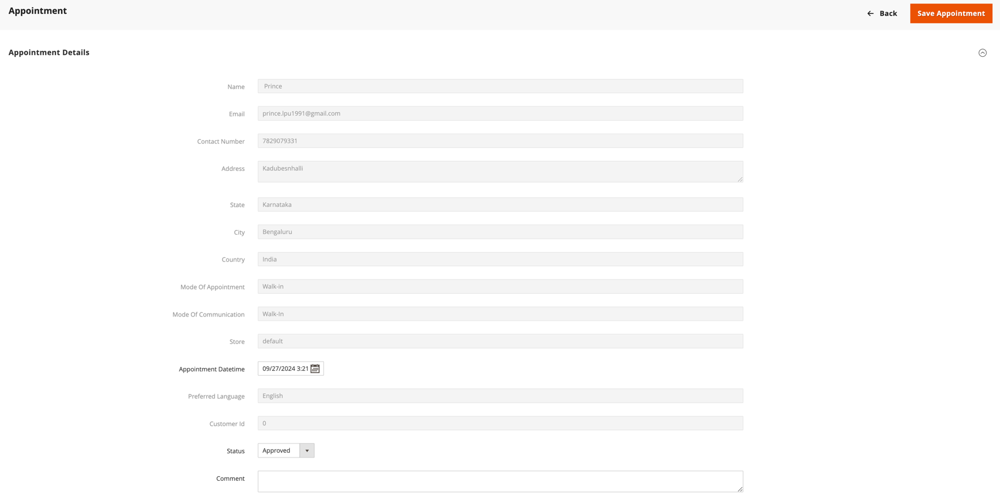

# MageMonk Base module

## Summary
Magento 2 module to book an appointment

## Installation
```shell
composer require mage-monk/module-appoinment
```

## Frontend Screenshot


## Backend Screenshot
List 


Form

